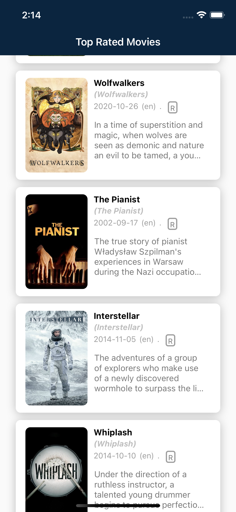

# Assignment

This project aws generated with [React Native CLI](https://reactnative.dev/docs/environment-setup) version 0.68.2

This is a project which has build to display top rated movies from the Movie Database(https://www.themoviedb.org).



## Project Structure

```
├── src/
│   ├── App.js
│   ├── components
│   └── models
│   ├── screens
│   └── store
│   └── util
├── package.json
└── ...
```

### API KEY

Api key is stored in the .env file. If the API key is invalid, you can obtain a new key by creating an account from Movie Database(https://www.themoviedb.org)

# Running the application

## Install dependencies

Run `npm install` for install dependencies

## Running the assignment application

### Step 01 : Start Metro

Run `npx react-native start` to run the metro bundler

### Step 02 : Start the application (IOS)

Let metro bundler run its own terminal. Open a new terminal inside the project and Run the following command
`npx react-native run-ios`

### Step 03 : Start the application (Android)

Let metro bundler run its own terminal. Open a new terminal inside the project and Run the following command
`npx react-native run-android`
